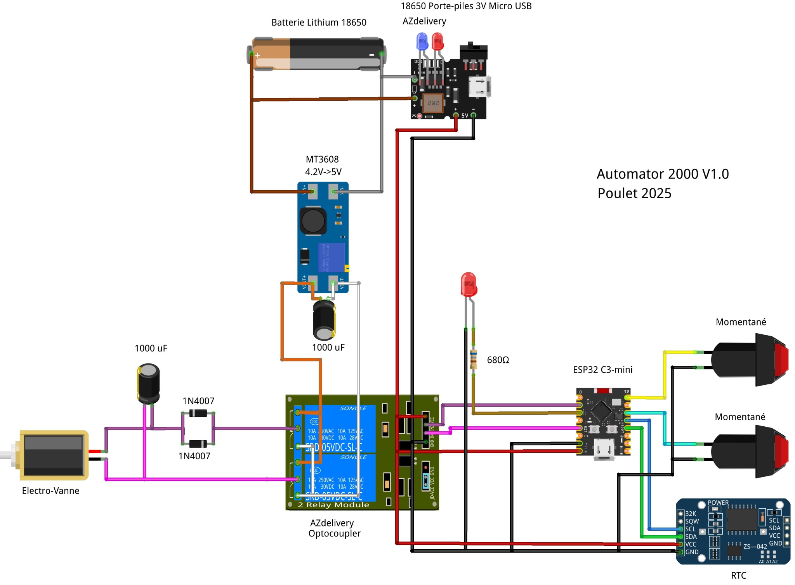
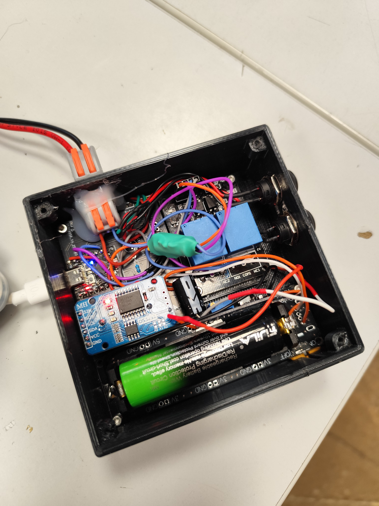
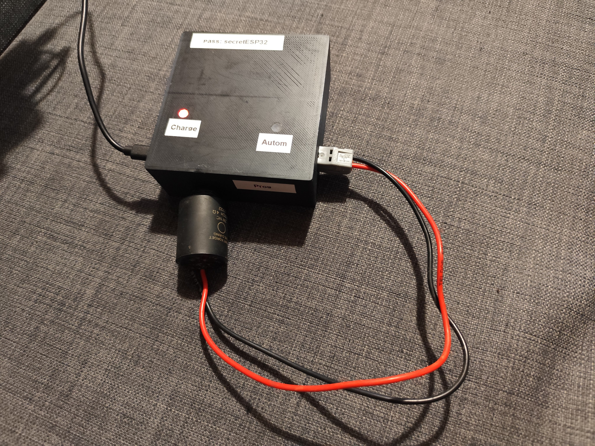
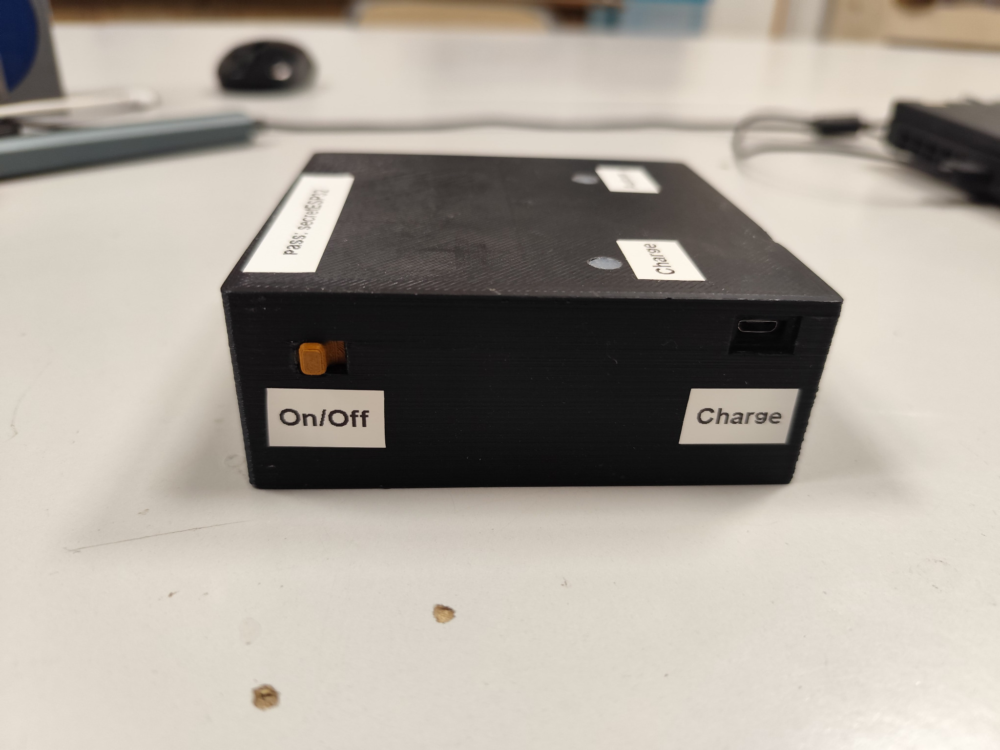
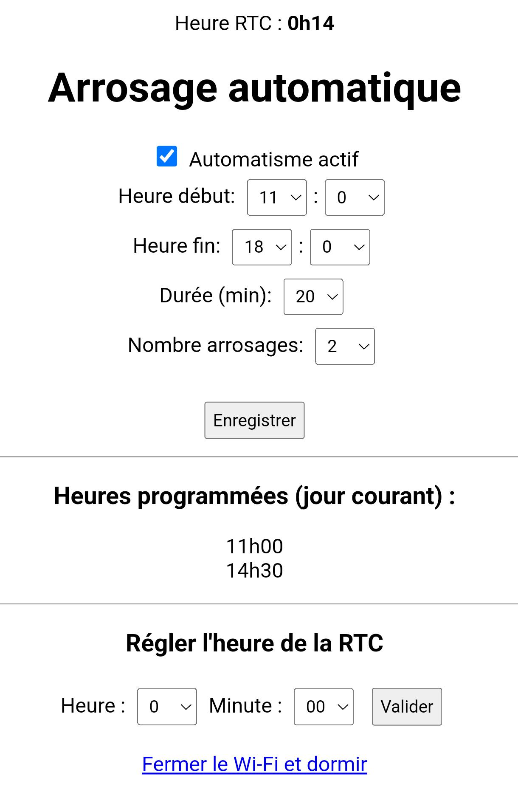

# OpenDrop

**Low-power wireless irrigation controller**

Open-source autonomous irrigation controller based on an ESP32-C3 Mini.

---

## Description

OpenDrop is a battery-powered irrigation controller designed for small gardens, planters and DIY watering systems.

The project uses an **ESP32-C3 Mini** with deep sleep for low power consumption and a **DS3231 RTC** for reliable scheduling without internet or cloud dependency.

The controller drives a latching irrigation valve through relay pulses and exposes a local Wi‑Fi web interface for configuration.

The entire project is open-source:

- firmware;
- hardware;
- enclosure;
- wiring;
- documentation.

---

##  Features

- RTC-based irrigation scheduling
- Deep sleep low-power operation
- Local Wi‑Fi configuration portal
- Battery-powered operation
- Relay-controlled irrigation valve
- Configurable watering duration
- Configurable watering cycles
- EEPROM configuration storage
- Fully hackable firmware
- No cloud required

---

## Hardware

### Required

- ESP32-C3 Mini
- DS3231 RTC module
- 2-channel relay module
- MT3608 boost converter
- 18650 Li-ion battery
- AZ Delivery Battery Expansion Shield 18650
- Pulse-operated latching solenoid valve (+5V / -5V polarity reversal)
- 2 push buttons
- LED + resistor
- 1N4007 diode
- 1000 uF capacitors

---

## Wiring

<p align="center">
  
</p>

---

## Prototype Photos

<p align="center">
  
</p>
<p align="center">
  
  
</p>

---

## Web Interface

You can:

- Enable or disable automatic watering
- Configure watering time range
- Configure watering duration
- Configure watering cycles per day
- Set RTC time
- Put the controller back to sleep

<p align="center">
  
</p>

---

## Buttons and LED

### Wi‑Fi Button

Hold the Wi‑Fi button during wake-up to enable the local Wi‑Fi configuration portal.

Default configuration:

```txt
SSID: arrosageESP
Password: secretESP32
Address: http://192.168.4.1
```

The portal automatically closes after 5 minutes.

---

### Automation Button

Hold the automation button during wake-up to toggle automatic watering ON or OFF.

The state is saved in EEPROM.

---

### LED Behavior

| LED behavior | Meaning |
|---|---|
| Solid ON | Valve open |
| Two short blinks | Automation enabled |
| One long blink | Automation disabled |
| Slow blinking | Wi‑Fi portal active |
| OFF | Deep sleep mode |

---

## Firmware

Location:

```txt
firmware/OpenDrop/OpenDropFW/OpenDropFW.ino
```

---

## Arduino IDE Setup (ESP32‑C3)

### 1. Add ESP32 boards

Open Arduino IDE:

- Go to **File → Preferences**
- In **Additional Boards Manager URLs**, add:

```txt
https://raw.githubusercontent.com/espressif/arduino-esp32/gh-pages/package_esp32_index.json
```

---

### 2. Install ESP32 package

- Go to **Tools → Board → Boards Manager**
- Search: `esp32`
- Install:

```txt
esp32 by Espressif Systems
```

Tested version:

```txt
3.3.5
```

---

### 3. Select board

- Tools → Board → ESP32 Arduino
- Select:

```txt
ESP32C3 Dev Module
```

---

### 4. Required libraries

Install from Arduino Library Manager:

| Library | Tested version |
|---|---:|
| RTClib by Adafruit | 2.1.4 |
| Adafruit BusIO | 1.17.4 |

---

## Usage

### First boot

- Power the device
- Hold the Wi‑Fi button during wake-up
- Connect to the Wi‑Fi access point

---

### Connect

```txt
SSID: arrosageESP
Password: secretESP32
```

Open in browser:

```txt
http://192.168.4.1
```

---

## Known Issues

- No battery level monitoring
- Prototype enclosure is not fully waterproof
- No authentication on the web interface
- No OTA firmware update system

---

## Main components:

- ESP32-C3 Mini
- DS3231 RTC module
- 2-channel relay module
- MT3608 boost converter
- AZ Delivery Battery Expansion Shield 18650
- DC irrigation valve


---

## Project Structure

```txt
OpenDrop/
├── firmware/
├── hardware/
├── enclosure/
├── docs/
├── LICENSES/
├── README.md
└── LICENSE
```

---

## Author

**Jean-Sébastien Niel**

GitHub:
https://github.com/jsniel

---

## License

OpenDrop uses separate licenses for firmware and hardware.

### Firmware

GNU General Public License v3.0 or later

```txt
GPL-3.0-or-later
```

### Hardware

CERN Open Hardware Licence Version 2 - Strongly Reciprocal

```txt
CERN-OHL-S-2.0
```

---

## ⚠️ Disclaimer

This project is an experimental DIY open hardware prototype.

OpenDrop switches electrical loads and may be used near water.

Always:

- verify wiring;
- protect electronics from humidity;
- use waterproof connectors;
- verify valve voltage compatibility;
- use appropriate battery protection.

This project is provided without warranty.

---

## Contributing

Pull requests and hardware improvements are welcome.
